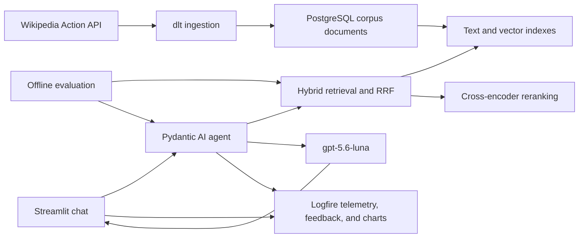

# Architecture

> Keep this file at system level. Put detailed rules in the linked documents.

## Boundaries

- PostgreSQL is the only persistent corpus and search store. See
  [Data model](docs/data-model.md).
- Logfire is the only telemetry and user-feedback store, and the charts are drawn
  there over the spans the app already sends. Nothing copies metrics into
  PostgreSQL or into a reporting page of its own. See
  [Monitoring](docs/monitoring.md).
- dlt writes cleaned corpus documents straight to PostgreSQL. See
  [Ingestion](docs/ingestion.md) and [Corpus](docs/corpus.md).
- A separate indexing step derives search units and embeddings in PostgreSQL.
  See [Retrieval](docs/retrieval.md).
- Pydantic AI owns the agent loop and typed search tool. Install
  `pydantic-ai-slim[openai]`, not the full `pydantic-ai`: the project uses one
  model provider, and the full package pulls every other provider's SDK.
- `gpt-5.6-luna` is the default answer model. See [Agent](docs/agent.md).
- Embeddings run locally on CPU through ONNX Runtime, so no embedding provider,
  API key, or GPU is part of the runtime. The encoder is
  `Xenova/bge-small-en-v1.5` at 384 dimensions, pinned to a commit so repeated
  runs produce identical vectors. [Retrieval](docs/retrieval.md) owns why it is
  the only one.
- A cross-encoder reranks the candidates hybrid search returns, on the same CPU
  and ONNX Runtime as the encoder. It scores query and passage together, which
  neither embedding nor RRF does. See [Retrieval](docs/retrieval.md).
- Streamlit owns chat, feedback controls, and reporting views. See
  [Chat](docs/chat.md).

Docker Compose will run the application and PostgreSQL with a named database
volume. Wikipedia, OpenAI, and Logfire remain external APIs.

## Quality flow

Offline evaluation compares retrieval choices before the best one becomes the
app default, and judges whole answers the same way. Live runs, judge results,
timings, usage, errors, and feedback go to Logfire, where the charts read them in
place. See [Evaluation](docs/evaluation.md) and [Roadmap](ROADMAP.md) for the
order this happens in.

There is no cloud deployment, scheduled ingestion service, DuckDB layer, or
migration framework in the first release.
