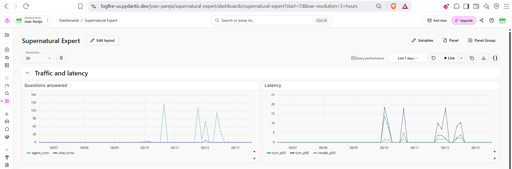
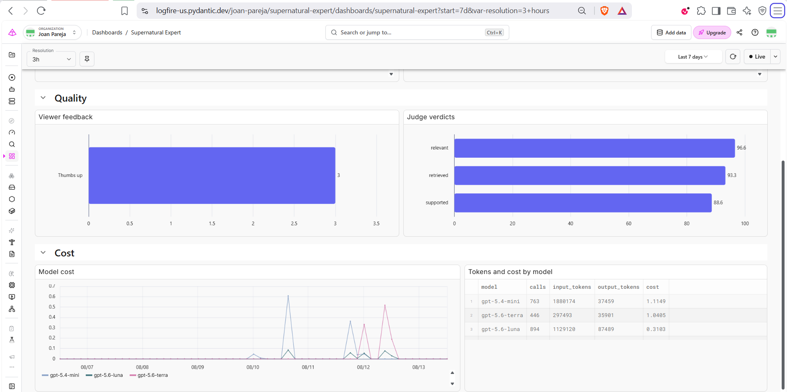

# Journey

> The short version of how this was built and why. [Rubric](docs/rubric.md)
> tracks what is scored; this note explains what happened. Every section links
> to the document that owns the detail, so nothing here needs to be long.

## The problem

An expert that answers only from an approved corpus. Not from the internet, and
not from whatever the model happens to remember. Answers come from documents the
project chose, which makes them consistent, cheap, and checkable.

The first idea was to pull a corpus on demand for whichever show a viewer picked.
It would have worked, and it would have kept working past any model's knowledge
cutoff. It was dropped because the project would have become an ingestion
ceremony rather than a retrieval system. One show is locked instead:
*Supernatural*, seasons 1 to 6.

Locking it bought more than focus. A corpus that never changes can have a fixed
set of test questions, and fixed questions are what make every measurement below
comparable to the one before it.

Spoiler safety falls out of the same choice. Seasons past 6 were never loaded, so
there is nothing to filter and nothing to leak — a question about season 7 is one
the corpus cannot answer, and is refused as such.

See [Scope](docs/scope.md).

## Getting the corpus in

Wikipedia stores episode data as wikitext templates, which are awkward: values
contain nested links, templates, and citations, so naive splitting corrupts them.
Existing parsing libraries were compared before anything was written; the finding
is in [Wikipedia extraction alternatives](docs/research/wikipedia-extraction-alternatives.md).
A small purpose-built parser won, because the corpus is fixed and small and the
library would have brought more surface than it removed.

Episodes alone could not answer a question about a season — how it opened, what
changed across it, where it left off. So each season got an introduction document
of its own, taking the corpus from 126 documents to 132. Those six are what let
the system answer at the season level instead of only the episode level. They
share a shape without sharing content, which is a fair thing to ask retrieval to
tell apart, and it turned out to be the harder half of the job.

The load runs through **dlt**, in one command, from pinned revisions.

See [Ingestion](docs/ingestion.md) and [Corpus](docs/corpus.md).

## Embeddings and chunking

The course's default embedding model was replaced with `bge-small-en-v1.5`.

The original plan was to compare several encoders against our own questions, and
that was dropped. Public benchmarks already rank these models across far more
text than 426 questions about one television show, and they do it more carefully
than we could. Which encoder is best is simply not something this corpus can
settle, so it was taken from the published results and the questions were spent
on the decisions only this project could answer. The next size up was tried
anyway, early on, and made no difference here, so the index never paid for 768
dimensions.

Then a real bug. The tokenizer file published with the model had truncation fixed
at **128 tokens**, far below the **512** the model can actually read. Nothing
errors when that happens — the text past the cutoff is just dropped — and 131 of
the 132 documents would have been embedded from a fraction of themselves. The fix
was to ignore the file's limit and use the model's real window.

That is also what made chunking worth doing. The corpus is not uniform. Twelve
episodes carry a full standalone plot and average about 3,300 characters; the 114
summarised in a season table average about 950; the six season introductions sit
between them at about 1,400. None of that is unwieldy — they are all readable
documents — but one vector per document would have judged a rich plot by whichever
part happened to come first while judging a short summary on all of it, so the
same score would mean different things depending on which document produced it.

Cutting everything to at most 256 tokens puts them on even terms. 132 documents
become 180 search units, the twelve plots supplying 48 of them and anything
already short enough passing through whole.

**Search matches a piece, but the answer gets the whole document.** A small unit
is sharp enough to win its document a place in the results, and the agent is then
handed that document entire rather than the fragment that matched. An answer is
written with the full episode in front of it, the same way for a long plot as for
a short summary, instead of from whichever paragraph happened to score.

One thing is deliberately kept out of the embedded text: no season, episode
number, or title is prepended to a piece. That would put an episode's name inside
every vector, and matching a name is not what an encoder is for. An anchor works
by being rare, and rarity is exactly what BM25 measures and what a dense vector
averages away. The lexical path already covers names, through the title as its
own indexed field. The two paths are not meant to do the same job, and making the
vector side imitate the lexical one would cost the thing it is actually good at.

See [Retrieval](docs/retrieval.md).

## Search, and the change that reset everything

Three retrieval paths were built before any was chosen: lexical, vector, and a
hybrid that fuses both with reciprocal rank fusion at the constant its paper
publishes, left untuned.

Vector search runs exact, with no approximate index over it. HNSW and IVFFlat
trade recall for speed and start repaying that trade in the tens of thousands of
vectors; this corpus holds a few hundred, where a plain scan is both faster —
there is no index to traverse or rebuild — and perfectly recalling. At this size
the fancier option would have cost precision and bought nothing measurable.

The first evaluation showed lexical search finding almost nothing: the right
document came back for **8 of 426** questions. It was contributing nothing at
all, and the reason was how PostgreSQL's built-in text search treats a question.
It required *every* term to appear in a document before that document counted as
a match. A viewer's question always carries words no episode summary contains, so
most questions matched nothing whatsoever. The handful that did match were then
ranked by a score computed inside a single document, which has no way of knowing
that "Dean" appears in almost every episode and "Roadhouse" in almost none — so a
common word counted for as much as a rare one.

**Switching to BM25 fixed both halves at once.** A document now matches if it
carries *any* of the question's terms, and each term is weighted by how rare it is
across the whole corpus, which is exactly what makes a name or a place worth
searching for. The same measurement went from **8 of 426** to **400 of 426**.
Nothing else in the project moved a number anywhere close to that, and it changed
what every other result meant: before it, hybrid looked indistinguishable from
vector alone; after it, lexical was the strongest single path and fusing the two
beat either.

**Reranking was added next, to see whether the ordering could be pushed further.**
A cross-encoder reads the top twenty results and scores each one against the
question directly, instead of comparing two vectors that were made without ever
seeing each other. It earned its place: MRR 0.808 to 0.881.

Then every question it still got wrong was read, one at a time. Of 43 misses,
three documents never reached the candidate list, thirty-three were ordinary
ranking failures, and seven had been ranked well by fusion and then pushed *down*
by the reranker. That last group pointed at the reranker itself, so a deeper one
was tried on the expectation that it would recover exactly those. It did.

**Optuna was in the plan, and was dropped.** Once the paths were measured, every
parameter it would have searched turned out to be settled already — the fusion
constant by its paper, the candidate depth by a corpus of 132 documents, and the
one dial that would have moved the result is exactly the dial a few hundred
questions can be fitted to rather than measured by.

**Query rewriting is not a separate stage, because the agent already does it.**
It composes the words it sends to search rather than passing the question
through. That was measured too — see below.

## How anything gets decided

Every choice above rests on the same machinery, built once.

**426 questions**, generated from the corpus, each labelled with the one document
that answers it, covering all 132 documents.

**Split by document, not by question.** A fifth of the documents are held out, so
questions about one episode can never land on both sides. The split is seeded and
committed, and a test regenerates it to prove the committed file is the one the
seed produces.

**Setups are compared question by question.** Two setups answer the same
questions, the results are subtracted per question, and the confidence interval
is drawn over those differences. This is sharper than comparing two averages,
because a question hard for one setup is usually hard for both and subtracting
removes the difficulty they share. An interval that still contains zero is a tie,
and a tie goes to the simpler setup.

**The held-out side answers one question, once:** does the winner hold up on
documents no comparison ever saw? It is never used to choose between setups,
because a set used to choose is no longer a set that can check the choice.

**The questions were written twice.** The first set gave us a baseline. The
second was rewritten to ask the way a viewer actually asks — looser, more varied
in length, and with at least one question per document naming nobody and nothing.
The originals leaned on rare proper nouns, which flattered lexical search;
removing that lean cost lexical 0.14 MRR and vector 0.05, so the advantage had
been real and was never earned. Labels, counts, and the held-out split were left
alone, no setup was compared while the rewrite was under way, and scores from
before it do not compare to scores after. One question turned out to be
answerable by two documents and was relabelled, and a handful phrased too vaguely
for any retriever were fixed.

See [Evaluation](docs/evaluation.md).

## What the numbers say

Five setups, 343 tuning questions. Hit@1 is how often the right episode came back
first; MRR is how high up it landed on average.

| Setup | hit@1 | hit@5 | MRR |
|---|---|---|---|
| lexical | 0.554 | 0.784 | 0.654 |
| vector | 0.519 | 0.711 | 0.604 |
| hybrid | 0.633 | 0.837 | 0.724 |
| hybrid + reranking | 0.758 | 0.895 | 0.818 |
| **hybrid + deeper reranking** | **0.816** | **0.910** | **0.853** |

Each setup was measured against the simpler one it had to beat, and every step
cleared its interval: fusing beats lexical alone by 0.070, reranking beats fusion
by 0.095, and the deeper cross-encoder beats the smaller one by 0.035.

The last of those was the first full use of the machinery: two models, compared
on the tuning side, winner adopted, then read once against the held-out
documents. **Tuning 0.853, held-out 0.855.** A gap of 0.001 says the score was
not inflated by having chosen the winner on those questions.

Worth being honest about that comparison: public benchmarks already rank these
two cross-encoders in the same order, so the result was not a discovery. What it
demonstrated is that the split, the paired intervals, and the held-out
confirmation work end to end on a real decision.

Full tables: [`retrieval_scores.csv`](evaluation/results/retrieval_scores.csv),
[`retrieval_differences.csv`](evaluation/results/retrieval_differences.csv), and
[`retrieval_held_out.csv`](evaluation/results/retrieval_held_out.csv).

## The agent

**Pydantic AI** runs the loop, and one choice earned four things: it schedules the
search calls, turns the search function into a typed tool the model can call,
parses the answer into a validated structure, and wires into Logfire with a
single line.

That typed structure turned out to be worth more than a return type. Pydantic AI
hands the model the answer schema as the tool it has to call to finish, so the
field names and the descriptions on them are the last thing it reads before
writing. A rule belonging to one field can therefore sit on that field — that a
citation is a document identifier and never a title or a URL — instead of
competing for attention with every other line of the system prompt. Carrying the
output as an object is also what makes it safe to use afterwards: the chat reads
citations from a validated list rather than parsing them back out of prose.

The model gets one tool, `search_episodes`, with optional season and episode
filters it is told to leave alone unless the viewer names one — a wrong guess
hides the answer rather than narrowing to it.

A few things it does on purpose:

- The first search sends the question word for word, and it is code rather than
  an instruction. Measurement showed the agent's own phrasing reaches the
  answering document about six points less often than the question as asked,
  because a paraphrase drops the names the documents match on. Asking for it in
  the instructions was tried first; a trace showed the model rewriting anyway.
- Every search after the first may be rewritten freely into the show's own
  vocabulary, which is what finds an episode a viewer described loosely. Two of
  them is the budget: the same trace spent six searches on five rewordings of one
  question, two of which returned identical documents.
- Answers cite the documents they rest on, and every citation is checked against
  what that run actually retrieved. A model that has read three documents can
  still cite a fourth it remembers; this is the part of grounding that does not
  depend on the model cooperating.
- What the corpus does not cover is said plainly, with nothing cited.
- Which search path runs is not the model's to pick. Lexical, vector, and hybrid
  were compared, hybrid with reranking won, and that is locked in code. A model
  choosing per question would mean every number above described a setup that no
  longer runs.

See [Agent](docs/agent.md).

## Judging the answers

Retrieval scores measure search. They say nothing about whether the answer was
any good, so answers are judged too. A second model reads the question, the
answer, and the documents cited with it, and rules on two things: whether the
answer addresses the question, and whether every claim it makes appears in those
documents. A third measure needs no model at all — whether search reached the
labelled document in the first place.

The judge is `gpt-5.6-terra`, deliberately not the model that writes the answers,
because a judge sharing the answerer's blind spots passes its own mistakes.

Four changes came out of running this, each one visible before it was made.

**Three documents per answer instead of five.** The two were compared over 70
questions and every measure tied, so the cheaper setup won on the standing rule
that a tie goes to the simpler one. Answering is where nearly all the running
cost sits, and the smaller context is about a fifth fewer tokens per answer.

**The first search moved into code.** The instructions asked for the
question to be searched word for word, and a trace showed the model rewriting it
anyway — six searches in one turn, five of them rewordings of each other, two
returning identical documents. The verbatim search moved into code, where it is a
guarantee rather than a suggestion, and the model's own searches were capped at
two. A turn went from six searches to two, and from 55 seconds to 24.

**A better answering model.** `gpt-5.6-luna` replaced `gpt-5.4-mini`. Published
benchmarks already rank it higher, so it was adopted on those rather than
re-measured here — the same reasoning that chose the embedding model. It is also
about a third the price per token, which took the cost of an answer from $0.0026
to $0.0006.

**The model was told where to stop.** The judge records *why* it fails an
answer, and reading a dozen of those showed one pattern: the model was not
inventing episodes, it was adding connective tissue. Who forced the victim to
drink, why the fake call worked, that Ruby is a demon — all true of the series,
none of it in the cited document. One paragraph telling the model to answer at
the level of detail the documents hold, and to stop where they stop, halved those
failures.

Then the held-out side, read once, on documents no tuning run ever touched:

| measure | tuning | held-out |
|---|---|---|
| addresses the question | 1.000 | 0.988 |
| every claim supported | 0.914 | 0.892 |
| answering document retrieved | 0.986 | **1.000** |

83 questions, and the gaps are small enough to say the tuning numbers were not
flattered by the questions they were tuned on. Retrieval reached the right
document every single time.

Full tables: [`answer_scores.csv`](evaluation/results/answer_scores.csv) and
[`answer_held_out.csv`](evaluation/results/answer_held_out.csv), with the judge's
reasoning for every verdict beside them in the `_verdicts` files.

See [Evaluation](docs/evaluation.md).

## The interface

One Streamlit page. It asks questions, shows each answer with the sources behind
it, and takes a thumbs up or down on every one.

See [Chat](docs/chat.md).

## Monitoring

**Logfire, and nothing else.** One place for traces, token usage, errors, and
user feedback, rather than a telemetry tool beside a metrics table that would
drift from it.

The first instinct was to open a span around every search. Pydantic AI already
opens one for each tool call, covering the same work, so instead of a second span
the facts it could not know went on as attributes: which path ran, whether
results were reranked, which documents came back. The one span the project does
open is around the verbatim first search, which happens outside the agent where
no instrumentation can see it.

**The traces became a working tool.** Logfire publishes an MCP server, and
connecting it let the coding agent query spans directly while building rather
than read a dashboard afterwards. The six-search turn was found that way, a
search that looked catastrophically slow turned out to be a single stalled query
rather than the reranker, and every cost figure in this document was read from
spans instead of estimated.

Thumbs feedback goes through Logfire's annotations, so a rating attaches to the
run it judges instead of landing in a separate table with no way back to the
answer.

The dashboard is in Logfire too, and every panel reads spans the app already
sends: questions answered, latency, thumbs up against down, judge verdicts, cost
over time, and tokens and cost per model. `monitoring/dashboard.json` is the
definition it was created from, so a reviewer can rebuild it against a project of
their own. The judge panel reads the evaluation runs rather than the chat, since
nothing grades a live answer — the live signal is the thumb.

See [Monitoring](docs/monitoring.md).

## Reproducibility

Settings are loaded explicitly and passed to every client by hand. Nothing reads
the process environment, so no credential can be picked up by accident.

**One command and one secret.** `docker compose up` starts PostgreSQL and the
chat together. The image carries both ONNX models, pinned by revision, and
`uv sync --locked` installs from the same lock file a contributor uses, so the
image and the laptop end up with identical versions.

The corpus was the part worth thinking about. A reviewer will not run an
ingestion command before they can ask a question, and re-running one on every
start would refetch six seasons each time. So the container checks whether the
work is already done, does it if not, and skips it if so. That was tested rather
than assumed: from an empty database, 132 documents fetched, 180 units indexed,
and the page serving about thirty seconds after PostgreSQL came up.

## Running it in the cloud

The database decided where this could go. `pg_search` is a ParadeDB extension,
and no managed PostgreSQL offers it: not Neon, not Supabase, not RDS. Every free
tier built around a managed database was ruled out before it was considered, and
what remained was hosts that run the project's own containers.

Free tiers then failed on memory. A cross-encoder reranks on CPU beside
PostgreSQL and Streamlit, which together want more than 2 GB, and the 1 GB
instances AWS and Google give away cannot hold all three. Oracle's Ampere A1 is
the only free shape that clears the bar, at 4 ARM cores and 24 GB. It is also
contended enough that creation failed with an out-of-capacity error every time it
was asked, so the instance actually serving is an AMD one paid from trial
credits: larger than the work needs, and carrying an expiry the free shape would
not have.

**Nothing about the application changed to be hosted.** The same `compose.yaml`
runs, and the binding that made it work was already there. Both services publish
to `127.0.0.1`, chosen so that a laptop would not expose a database to the café
wifi, and on a server that is exactly what a reverse proxy wants: Caddy reaches
the chat over the loopback, and the containers stay unreachable from outside.
Caddy obtains its own certificate, so a public HTTPS address cost a two-line
configuration file and a free DuckDNS name.

The corpus step earned itself again here. The instance was handed a key and a
`docker compose up`, and it fetched six seasons from Wikipedia, indexed 180 search
units, and served the page without another command being typed.

See [Deployment](docs/deployment.md).
