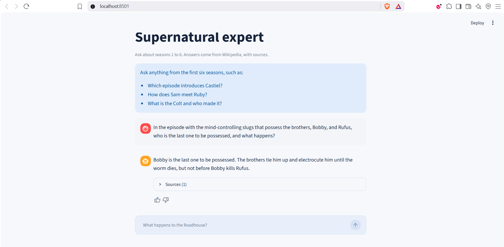

# Supernatural Expert

Ask questions about *Supernatural* seasons 1 to 6 and get an answer built from
Wikipedia, with the episodes it came from listed underneath. It will not tell you
anything past season 6, and it says so plainly when the corpus does not hold the
answer.

## Try it

It is already running at **<https://supernatural-expert.duckdns.org>**. Nothing
to install, and no key of your own to supply: ask it a question and it answers.
[Deployment](docs/deployment.md) covers where that runs.

To run your own copy you need Docker and an OpenAI API key. Nothing else: no
Python to install, no database to set up, no model files to fetch by hand.

```powershell
git clone https://github.com/joan-pareja/supernatural-expert
cd supernatural-expert
Copy-Item .env.example .env
```

Open `.env` and put your key on the `OPENAI_API_KEY=` line. Everything else in
that file already works, so leave it alone. Then start the whole thing:

```powershell
docker compose up
```

When the log says the app is running, open <http://127.0.0.1:8501>.



The first run is the slow one, and it takes several minutes. Docker downloads the
base images and builds the app image, then the container fetches the 132
documents from Wikipedia and builds the search index before the page opens. The
rest runs unattended, and the download is the part that varies most with your
machine. Later starts find all of that already done and reach the chat in
seconds.

`docker compose down` stops everything. Add `-v` only if you want the corpus
deleted and loaded again next time.

## Read the Journey while it builds

**[Journey](JOURNEY.md)** is how this was built: what was tried, what it was
measured against, what the numbers said, and what got thrown away afterwards. It
is meant to be read start to finish, and it covers every part the course rubric
scores.

[Rubric](docs/rubric.md) is the checklist version, one row per criterion saying
where its evidence lives. It tracks the official
[LLM Zoomcamp project rubric](https://github.com/DataTalksClub/llm-zoomcamp/blob/main/project.md).

## What it costs

Answering a question calls OpenAI, which costs money. Measured over the 223
questions behind the latest evaluation results, one answer costs under a tenth of
a US cent, roughly fifteen questions to the cent. A long conversation costs more
per answer, because each turn sends the ones before it again.

Nothing else costs anything. The two Logfire lines in `.env` can stay empty, and
the app then runs and sends no telemetry. Filling in a write token from a free
Logfire project turns the traces, cost figures, and dashboard on instead;
[Monitoring](docs/monitoring.md) gives the five steps.

## What it does

- A chat page that answers one question at a time and shows the sources under
  every answer.
- Two kinds of search over the corpus at once: one matching words, one matching
  meaning. Their results are merged, then reordered by a model that reads each
  result against the question.
- Answers written by `gpt-5.6-luna` through Pydantic AI, citing the documents
  they rest on, refusing spoilers past season 6, and saying so rather than
  guessing when the corpus does not cover the question.
- A thumbs up or down on every answer.
- Traces, token usage, cost, judge verdicts, and ratings in one Logfire project,
  with a six-chart dashboard reading them in place.

The knowledge base is 132 documents covering every episode of seasons 1 to 6,
loaded from the Wikipedia API by a repeatable dlt pipeline. It is fixed rather
than configurable on purpose: a two-week project spends its time better on
retrieval, evaluation, and monitoring than on loading an arbitrary corpus at
runtime. See [Corpus](docs/corpus.md), [Ingestion](docs/ingestion.md), and
[Architecture](ARCHITECTURE.md).

## Documentation map

Start with [Journey](JOURNEY.md). These are what it links into.

- [Scope](docs/scope.md): the problem and the boundary of the first release.
- [Architecture](ARCHITECTURE.md): the pieces and how they fit.
- [Corpus](docs/corpus.md): what the knowledge base contains.
- [Ingestion](docs/ingestion.md): how Wikipedia becomes corpus documents.
- [Data model](docs/data-model.md): the few stored concepts.
- [Retrieval](docs/retrieval.md): search, chunking, and reranking decisions.
- [Agent](docs/agent.md): how a question becomes an answer.
- [Chat](docs/chat.md): the Streamlit page and its feedback control.
- [Evaluation](docs/evaluation.md): how everything above was measured.
- [Monitoring](docs/monitoring.md): Logfire events, feedback, and the dashboard.
- [Deployment](docs/deployment.md): where the hosted instance runs and why.
- [Rubric](docs/rubric.md): the course checklist and where each point is earned.
- [Development](docs/development.md): tools, commits, and Markdown rules.
- [Roadmap](ROADMAP.md): build order.
- [Context](CONTEXT.md): project-specific words.

## License

Project code is released under the [MIT License](LICENSE). Wikipedia text keeps
its own license and attribution requirements; see [NOTICE](NOTICE.md).
